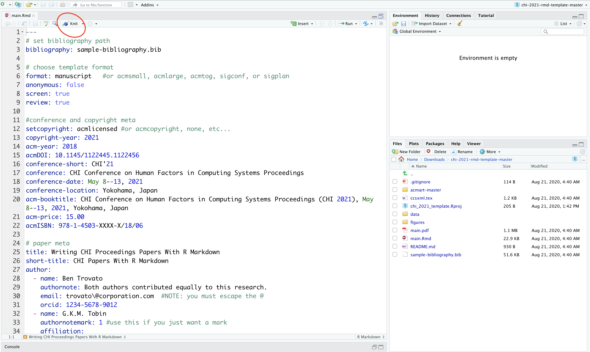

# ACM CHI 2021 template for R Markdown
This R package provides a template for writing ACM CHI Proceedings papers in R Markdown, and compiling to PDF via the LaTeX templates from the ACM Master LaTeX Template (v. 1.71).

## Requirements
- a LaTeX installation
- R and RStudio

## How to use
- download a copy of this repository (click the green 'Code' button, then 'download zip')
- open **chi_2021_template.Rproj** in RStudio

- replace the content in **main.Rmd** with your own fantastick work

- replace **sample-bibliography.bib** with your own bibliography
- click the 'Knit' button in RStudio to compile to pdf

- for general advice on how to use R Markdown for academic writing, see e.g. at https://ulyngs.github.io/oxforddown/

**NOTE: include the initial *setup_output* code chunk at the top of your .Rmd file, as it creates custom chunk options that allow you to e.g. add image descriptions for visually impaired readers.**
